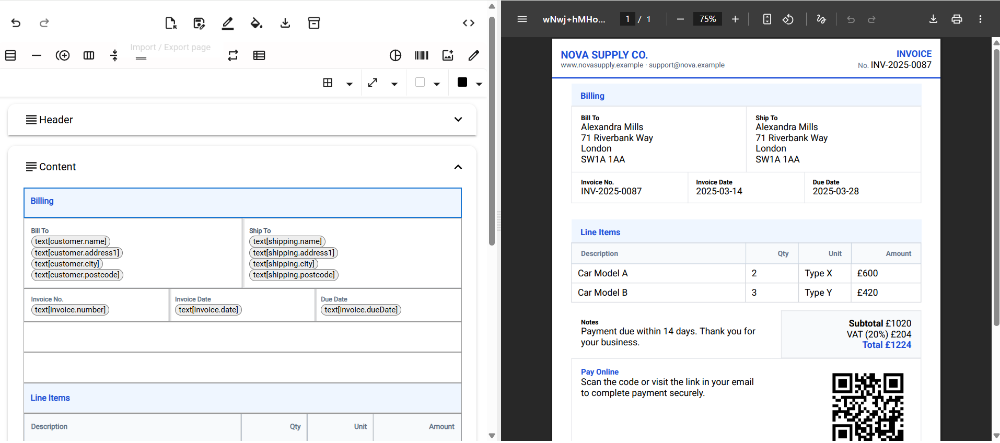

# WysiPDF

> ⚠️ **Disclaimer:** WysiPDF is **in active development**. Features and APIs may change without notice. Use at your own risk.

WysiPDF is a visual WYSIWYG editor **and** an embeddable runtime for building **dynamic, data-driven documents**.
Design once, then generate **PDF** or **standalone HTML** from **static tokens**, **live JSON**, or **looped partials**—all in the browser.



---

## 🚀 Live Demo

Try it in the browser: **[https://jstar15.github.io/WysiPDF/](https://jstar15.github.io/WysiPDF/)**

---

## ✨ Key Features

### Editor & Layout

* **Grid layout engine** with resizable columns, row re-ordering, and **explicit page breaks**.
* **Header & Footer** areas that repeat automatically on each page (natural height).
* **Quick styling** from a compact toolbar: padding, margins, border size/radius/color, background color, alignment.
* **Color Palettes**: create reusable, named swatch sets per template and use them anywhere.
* **Fonts**: five lean defaults (**Roboto, Raleway, Nunito, Cormorant, Open Sans**) with customizable fallback stacks.
* **Presets**: start from curated templates to accelerate common use-cases (invoice, consent form, report, label, etc.).

### Content Blocks

* **Rich Text** (Quill formatting) with inline tokens.
* **Images**: insert from file or base64; auto-embed for export (no external hosting required).
* **Charts**: Pie / Doughnut / Bar rendered to high-quality PNG; identical in PDF & HTML.
* **Barcodes & QR**: configurable **barcode block** (QR and common 1D/2D formats) rendered to PNG for reliable output.
* **Tables**: structured rows & cells that map well to tokens and arrays.
* **Spacers & Dividers**: fine-tune visual rhythm.
* **Page Breaks**: deterministic control over pagination.

### Tokens, Data & Logic

* **Token Editor**: add/edit tokens manually or **import from JSON** (arrays supported).
* **Dynamic token injection** at generation time (supply your payload and go).
* **Conditional display** via **AND/OR** rules evaluated live in the editor.
* **Partials** for re-usable sections.
* **Looping**: repeat partials over array tokens (per-item blocks with local context).

### Export & Runtime

* **PDF generation** (base64) via pdfMake.
* **Standalone HTML export** (self-contained, print-friendly; images, charts, and barcodes are embedded as PNG).
* **Live preview** pane mirrors the final layout.
* **Meta/Inspector view**: see **Page JSON**, **Tokens**, and **pdfMake definition** for transparent debugging.
* **Single-file bundle**: editor + runtime in one JS file. Drop it on any page, no server required.

---

## 📦 Installation & Usage

### Option A — Standalone (no build tools)

Include the built script and use the global constructor `WysiPDF` (exposed on `window.WysiPDF`):

```html
<script src="./wysipdf.bundle.js"></script>

<div id="editor-host"></div>

<button id="exportHtml">Export HTML</button>
<button id="exportPdf">Export PDF</button>

<script>
  // Optional: inject margins for nicer browser printing of exported HTML
  function injectPageMargins(html, page) {
    const bg   = (page?.pageAttrs?.backgroundColor) || '#ffffff';
    const font = (page?.pageAttrs?.defaultFont) || 'Roboto, Arial, sans-serif';
    const styleTag = `
<style id="wysi-export-margins">
  html { background: #f6f7f9; }
  body {
    margin: 32px auto !important;
    padding: 24px !important;
    max-width: 900px;
    background: ${bg};
    font-family: ${font};
    box-sizing: border-box;
  }
  @page { margin: 15mm; }
</style>`.trim();

    if (/<\/head>/i.test(html)) return html.replace(/<\/head>/i, styleTag + '</head>');
    if (!/<html/i.test(html))  return `<!doctype html><html><head>${styleTag}</head><body>${html}</body></html>`;
    if (!/<head>/i.test(html)) return html.replace(/<html([^>]*)>/i, `<html$1><head>${styleTag}</head>`);
    return html;
  }

  let wysi, page;

  window.addEventListener('DOMContentLoaded', async () => {
    wysi = new WysiPDF({ mount: '#editor-host' });

    // Minimal starter page
    page = {
      header: { rows: [] },
      content: { rows: [] },
      footer: { rows: [] },
      pageAttrs: {
        backgroundColor: 'white',
        marginTop: 10, marginRight: 0, marginLeft: 0, marginBottom: 10,
        footerMargin: 50, headerMargin: 30, defaultFont: 'Roboto'
      },
      tokenAttrs: [{ name: 'customerName', value: 'Jane Doe', type: 'TEXT' }],
      partialContent: [],
      colorPalettes: ['#111827','#F59E0B','#3B82F6','#10B981','#EF4444']
    };

    await wysi.loadPage(page);
    await wysi.onPageChange(p => (page = p));

    // Export HTML
    document.getElementById('exportHtml').addEventListener('click', async () => {
      const raw  = await wysi.generateHtml(page, page.tokenAttrs || []);
      const html = injectPageMargins(raw, page);
      const blob = new Blob([html], { type: 'text/html;charset=utf-8' });
      const url  = URL.createObjectURL(blob);
      const a = Object.assign(document.createElement('a'), { href: url, download: 'wysipdf.html' });
      document.body.appendChild(a); a.click(); a.remove(); URL.revokeObjectURL(url);
    });

    // Export PDF
    document.getElementById('exportPdf').addEventListener('click', async () => {
      const base64 = await wysi.generatePdfBase64(page, page.tokenAttrs || []);
      const a = document.createElement('a');
      a.href = 'data:application/pdf;base64,' + base64;
      a.download = 'wysipdf.pdf';
      a.click();
    });
  });
</script>
```

### Option B — ESM / Angular

Import and use like a normal module; the same generation runtime is available without mounting the editor.

```ts
import WysiPDF from 'wysipdf'; // or relative path to your built bundle

const wysi = new WysiPDF();
const html  = await wysi.generateHtml(page, tokens);
const pdf64 = await wysi.generatePdfBase64(page, tokens);

// Angular services also available (e.g., PageToHtmlService, PdfGenerateService)
```

---

## 🧭 Runtime API (Editor Optional)

All methods are **async**.

| Method                                  | Description                                         |
| --------------------------------------- | --------------------------------------------------- |
| `loadPage(page)`                        | Load a page model into the editor host              |
| `onPageChange(cb)`                      | Subscribe to live edits of the page model           |
| `generatePdfBase64(page, tokens)`       | Produce a PDF (base64) from a page + dynamic tokens |
| `generatePdfBase64FromJson(page, json)` | Produce a PDF from a raw JSON payload               |
| `generateHtml(page, tokens)`            | Produce standalone HTML (string) for the page       |
| `generateHtmlFromJson(page, json)`      | Produce HTML from a raw JSON token payload          |

> If you only need generation, you can omit the editor host entirely.

---

## 🧱 Blocks Overview

* **Text**: Quill-powered rich text; supports inline tokens and inline styles.
* **Image**: File upload or base64; size, alignment, and alt text.
* **Chart**: Pie/Doughnut/Bar; legend, labels, value binding; exported as PNG.
* **Barcode / QR**: Value, format, size, quiet zone; exported as PNG for crisp print.
* **Table**: Rows/cells, header styling; pairs well with array tokens.
* **Spacer / Divider**: Visual rhythm control.
* **Page Break**: Forces a new page at a deterministic point.

---

## 🧩 Tokens, Partials & Looping

* **Token types** include text, numbers, booleans, dates, JSON/array, and more.
* Import tokens directly from a **JSON payload** and map them into the template.
* **Condition Builder** lets you show/hide any block based on token rules (AND/OR).
* **Partials** are reusable sections; you can **loop** a partial over an array token to render it once per item.

---

## 🧪 Debugging & Inspector

* **Live Preview** updates on every change.
* **Meta/Inspector view** shows:

  * Current **Page JSON**
  * Current **Token payload**
  * Generated **pdfMake definition**
    This makes it easy to spot missing tokens, shape mismatches, and layout quirks.

---

## 🖨 Export Details

* **PDF**: generated via pdfMake and returned as base64 (ready to download or post).
* **HTML**: exported as a **self-contained** document; images, charts, and barcodes are embedded as PNGs for maximum portability and print fidelity.
* **Definition**: you can also extract the intermediate pdfMake definition for custom pipelines.

---

## 🎛 Theming

* Set a **default font** at the page level and override per cell.
* Use **Color Palettes** to enforce brand colors across a template.
* Page background color and margins are configurable; headers/footers have their own margins.

---

## 🗺️ Roadmap

* Additional presets (invoice, quote, receipt, shipping label, certificate, dashboard).
* “**Preflight**” drawer: missing tokens, overset text, large assets, font fallbacks.
* Type definitions and a light `validate(page)` (Zod/Ajv).
* Richer table/column flows (keep-with-next, orphan control) where feasible.

---

## 📄 License

MIT

---


Add section break.
this will try put everthing above on the same page (keep cell on one page option
)